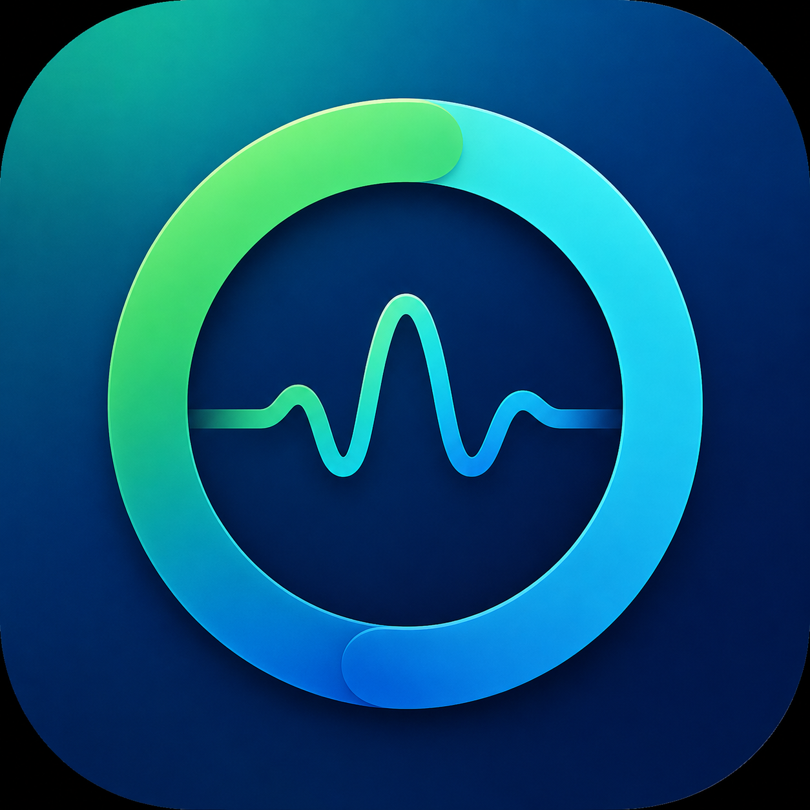

# DigitalBalance

<p align="center">
  
</p>

DigitalBalance is a privacy-first Android digital wellbeing and productivity app. It turns on-device foreground app activity into understandable usage history, configurable goals, explainable scores, calm insights, focus sessions, and optional reminders.

## Highlights

- Real foreground app usage reconstructed from Android `UsageEvents`
- Daily and seven-day app/category analytics
- User-controlled categories and persistent category overrides
- Overall, productive-time, category, and per-app goals
- Separate explainable Productivity and Goal Alignment scores
- Neutral, deterministic Smart Insights with no AI or cloud processing
- Local Focus sessions with recovery and history
- Optional limit reminders and an evening daily summary
- Polished Material 3 interface with light and dark themes
- Adaptive launcher icon, themed icon support, and Android splash screen

## Privacy

DigitalBalance is offline-first:

- Usage processing stays on the device
- No account, backend, analytics SDK, or network API
- No notification reading or Accessibility Service
- Usage data is excluded from Android backup
- Reminder notifications are disabled until explicitly enabled

## Permissions

- **Usage Access:** Reads Android usage events to calculate foreground app activity. This is Special App Access, not a runtime permission.
- **Notifications:** Optional on Android 13+ and requested only after reminders are enabled.

The rest of the app remains usable if notification permission is denied.

## Technology

- Kotlin
- Jetpack Compose and Material 3
- Room for durable usage history, goals, categories, and Focus sessions
- WorkManager for the optional daily summary
- Android `UsageStatsManager` / `UsageEvents`
- Gradle Kotlin DSL

## Requirements

- Android Studio with Android SDK 37 installed
- Android 7.0 (API 24) or newer device/emulator
- Usage Access must be granted on the test device to display real usage

The Gradle wrapper and configured JVM toolchain are included in the repository.

## Build

On Windows:

```powershell
.\gradlew.bat assembleDebug
```

On macOS or Linux:

```bash
./gradlew assembleDebug
```

The debug APK is generated at:

```text
app/build/outputs/apk/debug/app-debug.apk
```

## Verification

```powershell
.\gradlew.bat test assembleDebug assembleRelease lint
```

Core usage calculations, scoring, goal alignment, analytics, Focus behavior, reminder thresholds, duplicate suppression, and daily summaries are covered by deterministic tests.

## Usage notes

- The primary metric is **Foreground app usage**, not total screen-on time.
- Launcher, lock-screen, and background components are filtered using general classification/session rules.
- DigitalBalance's own foreground activity is included in usage totals and history but excluded from Productivity scoring and classification coverage.
- WorkManager notifications are battery-conscious and may be delivered slightly later by OEM battery management.

## Project status

DigitalBalance is under active development. Current features are entirely local and require no hosted services.
